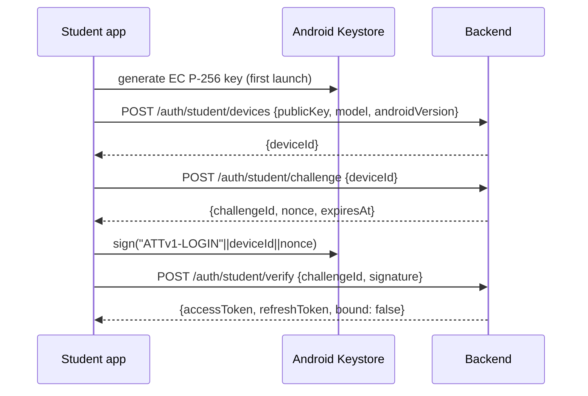

# Student Identity, NFC Protocol & Authentication

> Related: [Plan](./PLAN.md) · [API reference](./API.md)

---

## 1. How we tell students apart

### 1.1 What we cannot use

| Candidate identifier | Why it fails |
|---|---|
| NFC UID of the student phone | With Host Card Emulation, Android sends a **random UID on every activation**. The UID changes every tap |
| IMEI / serial number | Restricted to privileged apps since Android 10 |
| `ANDROID_ID` | Changes on factory reset, differs per app signing key, and is a hardware-linked identifier (the brief says hash or discard these) |
| Something the student types (index number) | Anyone can type anyone's index number |

### 1.2 What we use: a device-bound key pair plus a teacher-verified binding

Every student phone gets a **cryptographic identity** that cannot be copied:

1. On first launch the student app generates an **EC P-256 key pair inside the Android Keystore** (`KeyGenParameterSpec`, `PURPOSE_SIGN`, `DIGEST_SHA256`, `setIsStrongBoxBacked(true)` when available, else the TEE). The **private key never leaves the secure hardware** and cannot be exported, even by our own app.
2. The app sends the **public key** to the backend, which returns a random **`deviceId` (UUID)**. The app stores the deviceId in its private storage.
3. The **teacher binds the device to a person** during enrolment: they type the student's **name + index number** and tap the phone. The tap proves *this physical phone holds the private key for deviceId X*. The server then records `StudentDevice(X).studentId = Student(index).id`.

From then on, **the identity of a student is: "the holder of the private key for a device bound to index number N"**.

```
Student (index_number UNIQUE, full_name)        ← human identity, set by teacher
   └── StudentDevice (id = deviceId, public_key, status ACTIVE|REVOKED)
                                                 ← cryptographic identity, set by phone
```

### 1.3 Binding rules (enforced by the server)

| Situation | Result |
|---|---|
| New index number + unbound device | Create `Student`, bind device, create enrolment |
| Existing index number, same device already bound | Just add the enrolment (student is joining another class) |
| Device already bound to a **different** index number | **409 `DEVICE_BOUND_TO_OTHER_STUDENT`**. One phone can never check in two people |
| Index number already has a **different ACTIVE** device | **409 `STUDENT_HAS_OTHER_DEVICE`**. Teacher can retry with `replaceDevice: true` (lost/new phone or reinstall), which revokes the old device |
| Existing index number but the typed name differs | Keep the stored name, return a `warnings` entry so the teacher can check |

A partial unique index guarantees **at most one ACTIVE device per student**.

**Reinstall or new phone:** the Keystore key is lost, so the app registers again and gets a new deviceId. The teacher re-taps with "replace device". Old attendance records stay attached to the student.

### 1.4 Why this is strong enough

- **Cloning resistance:** knowing someone's deviceId is useless without their private key. Every tap signs a **fresh teacher-generated nonce**.
- **Proof of presence:** the signature is kept in `AttendanceRecord.signature`. Anyone, including the server, can later verify that the student's phone was within NFC range (~4 cm) of the teacher's phone for that session.
- **Replay:** a captured response only re-proves the same (session, student) pair. Uniqueness on `(sessionId, studentId)` makes that harmless, and the nonce stops reuse in other sessions.
- **Known limits (stated in the report):** a student could give their unlocked phone to a friend (buddy punching), and a live relay attack over the internet is possible in theory. Mitigations are listed in PLAN §12.

---

## 2. Keys, formats and the signed message

| Item | Value |
|---|---|
| Algorithm | ECDSA P-256 with SHA-256 (`SHA256withECDSA`) |
| Public key format | X.509 SubjectPublicKeyInfo DER (`key.getPublic().getEncoded()`), base64 in JSON |
| Signature format | ASN.1 DER (Android default; Node verifies with `dsaEncoding: 'der'`) |
| Domain separation | Every signed message starts with a context tag, so a login signature can never be reused as a tap and vice versa |

**NFC proof message** (bytes, concatenated):

```
"ATTv1-NFC"            9 bytes ASCII
purpose                1 byte   0x01 = ENROLL, 0x02 = ATTEND
contextId              16 bytes classId (ENROLL) or sessionId (ATTEND)
nonce                  16 bytes random, generated by host per tap
hostTime               8 bytes  unix ms, big-endian (host clock)
deviceId               16 bytes
```

**Login challenge message:**

```
"ATTv1-LOGIN" || deviceId(16) || serverNonce(32)
```

Server-side verification (Node):

```ts
import { createPublicKey, verify } from "node:crypto";
const key = createPublicKey({ key: device.publicKey, format: "der", type: "spki" });
const ok = verify("sha256", message, { key, dsaEncoding: "der" }, signature);
```

---

## 3. NFC APDU protocol

AID (proprietary, category `other`): **`F0 41 54 54 45 4E 44`** ("F0" + "ATTEND").
Custom commands use CLA `0x80`.

### 3.1 Student side: `apduservice.xml`

```xml
<host-apdu-service xmlns:android="http://schemas.android.com/apk/res/android"
    android:description="@string/hce_description"
    android:requireDeviceUnlock="false">   <!-- experiment factor -->
  <aid-group android:category="other" android:description="@string/aid_desc">
    <aid-filter android:name="F0415454454E44"/>
  </aid-group>
</host-apdu-service>
```

The service is declared with `android.permission.BIND_NFC_SERVICE` and the `HOST_APDU_SERVICE` intent filter. It reads `deviceId` from private storage and signs with the Keystore key directly in Kotlin, so **no JavaScript runs during a tap**.

### 3.2 Commands

| Step | Command (hex) | Data | Response |
|---|---|---|---|
| 1. SELECT | `00 A4 04 00 07 F0415454454E44 00` | n/a | `ver(1) \| deviceId(16) \| 90 00`, or `69 85` if the device is not registered yet |
| 2. AUTH | `80 10 P1 00 28 … 00` with P1 = `01` ENROLL / `02` ATTEND | `contextId(16) \| nonce(16) \| hostTime(8)` = 40 B | `deviceId(16) \| sigLen(1) \| signature(≈70–72) \| 90 00` |
| 3. CONFIRM | `80 20 P1 00 Lc …` with P1 = result code | UTF-8 display text ≤ 64 B, e.g. `Present: CS4473 L5 10:02` | `90 00`. Student phone shows a local notification |

**Result codes (CONFIRM P1):** `00` present, `01` late, `02` already marked, `03` enrolled OK, `10` not enrolled in this class, `11` outside the time window, `12` bad signature, `13` unknown device (host should refresh the roster).

**Error status words from the student side:** `6D 00` INS not supported, `6E 00` CLA not supported, `6A 86` wrong P1, `67 00` wrong length, `69 85` not registered, `6F 00` signing failed. If the student app isn't installed at all, Android itself answers SELECT with `6A 82`. The host reports that case as `STUDENT_APP_NOT_INSTALLED`.

The CONFIRM text is built on the host from the verdict and the session label, and truncated to 64 UTF-8 bytes. The student phone also logs each tap with its Keystore signing time (`signMs`), which is useful for the TEE vs StrongBox comparison.

`processCommandApdu` runs on the main thread. If Keystore signing is slow (StrongBox can take tens of ms), the service returns `null` and replies later with `sendResponseApdu()` from a background thread.

### 3.3 Host-side verdict for an ATTEND tap

1. Host has the session open and the roster cached (`GET /classes/{id}/roster-keys`).
2. `deviceId` is in the roster and ACTIVE, otherwise `13`/`10`.
3. Signature verifies against the cached public key (`java.security.Signature`, done in Kotlin), otherwise `12`.
4. `now ∈ [startsAt − checkInOpensBeforeMin, endsAt]`, otherwise `11`.
5. Not already in the local SQLite table for this session, otherwise `02`.
6. Status = LATE if `now > startsAt + lateAfterMin`, else PRESENT.
7. Write to SQLite (`clientRecordId = uuid`), send CONFIRM, play haptic + sound, queue for sync.
8. The server **re-verifies** every record in `POST /sessions/{id}/attendance/batch`.

### 3.4 Enrolment tap

The steps are the same, with purpose `ENROLL` and `contextId = classId`. The host sends the proof (`deviceId, nonce, hostTime, signature`) **online** to `POST /classes/{id}/enrollments` together with name and index number. The server verifies the proof, checks `|serverNow − hostTime| ≤ 5 min`, applies the binding rules (§1.3), and the host then sends CONFIRM `03`.

---

## 4. Authentication

There are two kinds of principals, so we use two login mechanisms that issue the **same token format**.

### 4.1 Tokens (both roles)

| Token | Format | Lifetime | Stored on phone |
|---|---|---|---|
| Access token | JWT (HS256 via `jose`), claims `{sub, role, fam, iat, exp}`. `role` ∈ `teacher` \| `student_device` | 15 min | memory |
| Refresh token | opaque 256-bit random. Server stores only its **SHA-256** | 30 days teacher, 180 days student device | `expo-secure-store` (Android Keystore-encrypted) |

- **Rotation with reuse detection:** every `/auth/refresh` revokes the old refresh token and issues a new one in the same `familyId`. If a revoked token is presented again, the whole family is revoked (signs out a stolen-token attacker).
- Every request: `Authorization: Bearer <access>`. Middleware verifies the JWT, then route-level guards check ownership.

### 4.2 Teacher: email + password

- `POST /auth/teacher/register` → argon2id hash (`@node-rs/argon2`, memory 19 MiB, t=2).
- `POST /auth/teacher/login` → tokens. Rate-limited (5 attempts / 15 min per email+IP). Errors don't reveal whether an email exists.
- Optional later: Google Sign-In, or restrict sign-up to the university email domain.

### 4.3 Student: device-bound challenge–response (no password)



- Before a teacher binds the device, the token works but the student only sees "Not enrolled yet: ask your lecturer to tap your phone".
- After binding, the same token works. The server resolves `studentId` from the device row on each request, so no re-login is needed. The student app refreshes its data when it receives the `ENROLLED` FCM data message.
- If the device is **REVOKED** (replaced by a new phone), all its refresh tokens are revoked and requests return `401 DEVICE_REVOKED`.
- Device registration is rate-limited per IP to stop mass fake registrations. Unbound devices older than 30 days are purged.
- Optional extension: send an **Android Key Attestation** certificate chain at registration to prove the key is hardware-backed (`hardwareBacked = true`).

### 4.4 Authorisation rules

| Resource | Rule |
|---|---|
| Class, its sessions, roster, analytics, exports | `role = teacher` and `class.teacherId = sub` |
| Attendance batch / manual edit | teacher owns the session's class |
| `/student/*` | `role = student_device`, device ACTIVE. Data limited to the bound student's active enrolments |
| Telemetry ingest | teacher (host app) |
| Notification ack | student device that the notification was sent to |

Other basics: HTTPS only, zod validation on every body/query, a consistent error envelope, no PII in logs, and CSV exports pseudonymised unless the teacher explicitly includes names.
