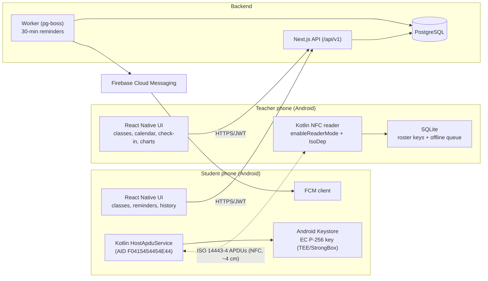
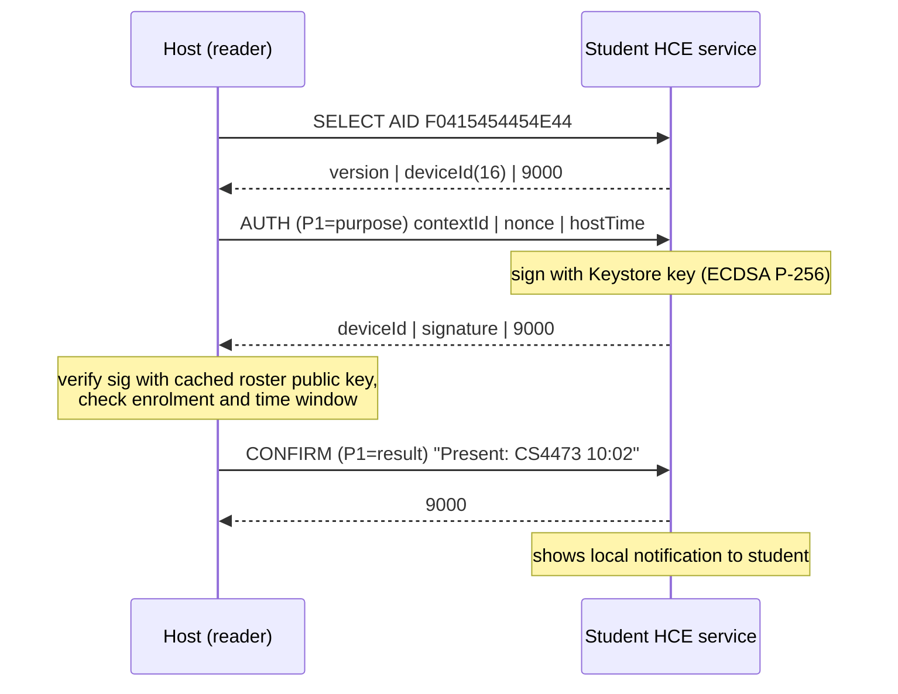

# Phase 1 Plan: NFC Phone-as-Card Attendance System

> CS4473 Mobile Computing: Group Research Project (Option I, our own idea)
>
> Related docs: [Identity, NFC protocol & auth](./IDENTITY_AND_AUTH.md) · [API reference](./API.md)

---

## 0. Read this first: assignment constraints that affect the design

The assignment brief adds some requirements on top of the product idea. Check these before writing code:

| Constraint in the brief | What it means for us | Action |
|---|---|---|
| Option I (own idea) **needs lecturer approval** before the proposal | Our idea is not in options A–H | Email the lecturer a short description (draft in §11) |
| "The prototype must be an Android app in **Kotlin or Java unless the lecturer approves otherwise**" | React Native needs explicit approval | Ask for it in the same email. Our argument: all platform-facing code (HCE service, NFC reader mode, Android Keystore, timing) is **native Kotlin**, and React Native only draws the UI |
| "Use the platform's **low-level APIs**". A thin wrapper around a library gets low marks | We must not rely on a black-box NFC library for the core feature | Write our own Kotlin modules for `HostApduService`, `NfcAdapter.enableReaderMode`, `IsoDep` and Keystore signing (§4) |
| Assessment is about an **experiment with our own measurements** | A finished app alone does not earn marks | Build tap telemetry into the host app from day one (§8), so the prototype doubles as the measuring instrument |
| "Keep it small", privacy, hash device identifiers | Don't store hardware IDs; pseudonymise exported data | Device identity is a random UUID plus a Keystore key (no IMEI, no NFC UID). Telemetry exports hash the device ID |
| Real Android phones; report model and Android version | iOS is out of scope (iOS HCE is restricted anyway) | Both apps are Android-only. Record the phone model and OS version with every measurement |

---

## 1. System overview

Three deliverables plus a shared package:

1. **Host app** (teacher's phone, React Native and Kotlin). It acts as the **NFC reader**. The teacher uses it to manage classes, enrol students by tap, schedule sessions on a calendar, run check-in, and view analytics.
2. **Student app** (student's phone, React Native and Kotlin). The phone acts as the **NFC card** through Host Card Emulation (HCE). Students see their classes, receive reminders 30 minutes before a session, and tap the teacher's phone to check in. The tap works **even when the app is closed**, because Android starts the HCE service itself.
3. **Backend** (Next.js route handlers on Node runtime, PostgreSQL). It provides auth, classes, enrolments, sessions, attendance sync, push scheduling, analytics and CSV export.
4. **Shared package** (TypeScript). It holds zod schemas, API types and APDU protocol constants, used by all three.



---

## 2. Tech stack

| Layer | Choice | Why |
|---|---|---|
| Monorepo | **pnpm workspaces + Turborepo** | One repo holds both apps, the backend and the shared types |
| Mobile framework | **React Native via Expo (development builds, `expo prebuild`)**, TypeScript, Expo Router | Native modules are easy to add through the Expo Modules API (Kotlin). **Expo Go cannot use NFC**, so we must use dev builds |
| Native NFC (student) | Custom **Kotlin `HostApduService`** + Android Keystore (`KeyPairGenerator` EC P-256, StrongBox if available) | Platform API, runs without JS, required for the "low-level API" marks |
| Native NFC (host) | Custom **Kotlin module** using `NfcAdapter.enableReaderMode` (`FLAG_READER_NFC_A \| FLAG_READER_SKIP_NDEF_CHECK`) + `IsoDep.transceive` | Precise timing with `SystemClock.elapsedRealtimeNanos()`. `react-native-nfc-manager` is a fallback only |
| Mobile state/data | TanStack Query, Zustand, `expo-secure-store` (tokens), `expo-sqlite` (host offline queue + roster cache) | Offline-first check-in |
| Calendar UI | `react-native-calendars` + `@react-native-community/datetimepicker` | Session scheduling |
| Charts | `react-native-gifted-charts` (or `victory-native`) | Bar, line, pie and heat-map style charts |
| Push | **Firebase Cloud Messaging** via `@react-native-firebase/messaging` + `expo-notifications` (channels, display) | Reminders |
| Backend | **Next.js (App Router) route handlers**, `runtime = 'nodejs'` | Required by the brief |
| ORM / DB | **Prisma** + **PostgreSQL 16** | Migrations, typed client |
| Validation | **zod** (shared with apps) | One schema for client and server |
| Auth | **jose** (JWT), **@node-rs/argon2** (password hashing), Node `crypto` (ECDSA verify) | See auth doc |
| Jobs | **pg-boss** (job queue stored in Postgres) in a separate worker process | Precise per-session reminder scheduling with no Redis |
| Push sender | **firebase-admin** (FCM HTTP v1) | |
| Dev infra | Docker Compose (postgres, backend, worker), Cloudflare Tunnel/ngrok for HTTPS to phones | |
| Analysis | Python (pandas, matplotlib) notebooks in `/analysis` | Experiment data package |

---

## 3. Repository layout

```
attendance-marking-system/
├─ apps/
│  ├─ backend/                    # Next.js
│  │  ├─ prisma/schema.prisma
│  │  ├─ src/app/api/v1/...       # route handlers (see API.md)
│  │  ├─ src/lib/                 # auth, db, nfc-proof verify, fcm, analytics SQL
│  │  └─ src/worker/index.ts      # pg-boss worker: reminders
│  ├─ host/                       # Teacher app (Expo RN)
│  │  ├─ app/                     # expo-router screens
│  │  └─ modules/nfc-reader/      # Kotlin: reader mode, IsoDep, timing, ECDSA verify
│  └─ student/                    # Student app (Expo RN)
│     ├─ app/
│     └─ modules/attendance-hce/  # Kotlin: HostApduService, Keystore, apduservice.xml
├─ packages/
│  └─ shared/                     # zod schemas, API types, APDU constants
├─ analysis/                      # notebooks + raw CSV exports for the report
├─ docs/
├─ docker-compose.yml
├─ pnpm-workspace.yaml
└─ turbo.json
```

---

## 4. Core mechanism: phone as an RFID/NFC card

Phones cannot act as plain 125 kHz RFID tags. Instead, Android phones can **emulate an ISO 14443-4 (NFC-A) smart card** with **Host Card Emulation**. Another phone in **reader mode** talks to it with **APDU** commands, the same protocol contactless bank cards use.

Facts that drive the design:

- **The NFC UID of an HCE phone is random on every tap**, so it **cannot** identify a student. Identity must be carried **inside the APDU exchange**. Details in [IDENTITY_AND_AUTH.md](./IDENTITY_AND_AUTH.md).
- The student app registers an **AID** (`F0 41 54 54 45 4E 44`, i.e. `F0` + "ATTEND") in `apduservice.xml` with category `other`. Android routes our `SELECT AID` to our service and to no other app.
- The HCE service is started **by the OS** on tap, so the student's app doesn't need to be open. The **screen must be on**. Whether a **locked** screen works is controlled by `android:requireDeviceUnlock`. Both are **experiment factors** (§8).
- The host phone uses **reader mode**, which disables its own card emulation and Android's default tag dispatch while the check-in screen is open.
- Short APDU responses are limited to 256 bytes. Our largest response (deviceId 16 B + DER ECDSA signature ≈ 72 B) fits easily.

APDU exchange during a tap:



The full byte-level spec is in [IDENTITY_AND_AUTH.md §3](./IDENTITY_AND_AUTH.md#3-nfc-apdu-protocol).

---

## 5. Functional scope (Phase 1)

### 5.1 Host app (teacher)

| # | Feature | Notes |
|---|---|---|
| H1 | Register / login (email + password) | JWT + rotating refresh token |
| H2 | Create / edit / archive **class** (name, optional code, attendance threshold default 80%, late-after minutes, check-in opens N minutes before) | |
| H3 | **Enrol a student by tap**: enter name + index number, then tap the student's phone | Binds that phone's key to the index number. Handles conflicts (phone already belongs to someone else, or a student got a new phone) |
| H4 | Roster list; remove a student; replace a lost device (re-tap) | |
| H5 | **Calendar** of sessions per class (month/week); create a session with **name, date, start time, end time**; edit/cancel | Creating, changing or cancelling a session reschedules the reminder job |
| H6 | **Live check-in screen** for a session: reader mode on, big status (green/red + haptic + student name), counter "23 / 40 present", list of present/late | Works **offline**: verifies signatures locally against cached roster keys and queues records in SQLite |
| H7 | Background sync of queued attendance and tap telemetry | Idempotent by `clientRecordId` |
| H8 | Manual override (mark present/excused with reason) | `source = MANUAL`, kept separate in analytics |
| H9 | **Analytics** per class and per student (§7) | |
| H10 | CSV export (attendance matrix, tap telemetry) | Needed for the data package |
| H11 | **Experiment mode**: choose condition labels (student phone, screen state, case, orientation, run #) that get attached to every tap event | Our measuring instrument |

### 5.2 Student app

| # | Feature | Notes |
|---|---|---|
| S1 | First launch: check NFC and HCE support (`FEATURE_NFC_HOST_CARD_EMULATION`), generate the Keystore key pair, register the device, request the notification permission (Android 13+) | No password needed (device-bound auth) |
| S2 | "Ready to tap" home card: NFC on? enrolled? next session countdown | Deep-link to NFC settings if NFC is off |
| S3 | My classes → class detail: my attendance %, history (present/late/absent), sessions needed to stay ≥ 80% | |
| S4 | Upcoming sessions list (all classes) | |
| S5 | **Push reminder 30 minutes before** each session | FCM. The app acks receipt for measurement |
| S6 | Tap to check in, then a local notification confirms the result ("Present ✓ CS4473 Lecture 5 at 10:02") | Notification is driven by the CONFIRM APDU, so it works even with no internet on the student phone |
| S7 | Settings: device ID (short form), re-registration warning, privacy notice | |

### 5.3 Backend

Auth, CRUD, enrolment with proof verification, attendance batch sync with re-verification, reminder scheduler, analytics queries, CSV export, telemetry ingest. The full list is in [API.md](./API.md).

### 5.4 Out of scope for Phase 1

iOS, web dashboard (optional later, since Next.js makes it cheap), multi-teacher classes, LMS integration, geofencing, biometric-gated keys (listed as an optional extension).

---

## 6. Data model (PostgreSQL via Prisma)

Tables are mapped to snake_case with `@@map`/`@map` (omitted below for brevity).

```prisma
generator client {
  provider = "prisma-client-js"
}

datasource db {
  provider = "postgresql"
  url      = env("DATABASE_URL")
}

enum DeviceStatus     { ACTIVE REVOKED }
enum AttendanceStatus { PRESENT LATE EXCUSED }
enum AttendanceSource { NFC MANUAL }
enum TapPurpose       { ENROLL ATTEND }
enum TapOutcome {
  OK DUPLICATE NOT_ENROLLED UNKNOWN_DEVICE BAD_SIGNATURE
  OUTSIDE_WINDOW TAG_LOST TIMEOUT PROTOCOL_ERROR
}

model Teacher {
  id           String   @id @default(uuid()) @db.Uuid
  email        String   @unique
  passwordHash String
  fullName     String
  createdAt    DateTime @default(now())
  classes      Class[]
}

model RefreshToken {
  id          String    @id @default(uuid()) @db.Uuid
  subjectType String    // "teacher" | "student_device"
  subjectId   String    @db.Uuid
  familyId    String    @db.Uuid      // rotation chain; reuse => revoke family
  tokenHash   String    @unique       // SHA-256 of opaque token
  expiresAt   DateTime
  revokedAt   DateTime?
  createdAt   DateTime  @default(now())
  @@index([subjectType, subjectId])
}

model Student {
  id          String   @id @default(uuid()) @db.Uuid
  indexNumber String   @unique         // canonical human identity, e.g. "200123X"
  fullName    String
  createdAt   DateTime @default(now())
  devices     StudentDevice[]
  enrollments Enrollment[]
  attendance  AttendanceRecord[]
}

model StudentDevice {
  id             String       @id @default(uuid()) @db.Uuid  // = deviceId sent over NFC
  studentId      String?      @db.Uuid                       // null until bound by a teacher tap
  student        Student?     @relation(fields: [studentId], references: [id])
  publicKey      Bytes                                       // SPKI DER, EC P-256
  keyAlgorithm   String       @default("ES256")
  hardwareBacked Boolean      @default(false)                // from KeyInfo / StrongBox flag
  status         DeviceStatus @default(ACTIVE)
  fcmToken       String?
  manufacturer   String?
  model          String?
  androidVersion String?
  appVersion     String?
  boundAt        DateTime?
  lastSeenAt     DateTime?
  revokedAt      DateTime?
  createdAt      DateTime     @default(now())
  @@index([studentId])
}
// raw SQL in migration: at most one ACTIVE device per student
// CREATE UNIQUE INDEX one_active_device_per_student
//   ON student_device(student_id) WHERE status = 'ACTIVE' AND student_id IS NOT NULL;

model AuthChallenge {
  id        String    @id @default(uuid()) @db.Uuid
  deviceId  String    @db.Uuid
  nonce     Bytes                       // 32 random bytes
  expiresAt DateTime                    // now + 2 min
  usedAt    DateTime?
}

model Class {
  id                    String    @id @default(uuid()) @db.Uuid
  teacherId             String    @db.Uuid
  teacher               Teacher   @relation(fields: [teacherId], references: [id])
  name                  String
  code                  String?
  thresholdPct          Int       @default(80)
  lateAfterMin          Int       @default(15)
  checkInOpensBeforeMin Int       @default(15)
  archivedAt            DateTime?
  createdAt             DateTime  @default(now())
  enrollments           Enrollment[]
  sessions              ClassSession[]
  @@index([teacherId])
}

model Enrollment {
  classId          String    @db.Uuid
  studentId        String    @db.Uuid
  class            Class     @relation(fields: [classId], references: [id], onDelete: Cascade)
  student          Student   @relation(fields: [studentId], references: [id])
  enrolledAt       DateTime  @default(now())
  enrolledDeviceId String?   @db.Uuid
  removedAt        DateTime?
  @@id([classId, studentId])
}

model ClassSession {
  id            String    @id @default(uuid()) @db.Uuid
  classId       String    @db.Uuid
  class         Class     @relation(fields: [classId], references: [id], onDelete: Cascade)
  name          String
  startsAt      DateTime  // timestamptz, stored UTC
  endsAt        DateTime  // CHECK (ends_at > starts_at) in migration
  cancelledAt   DateTime?
  reminderJobId String?   // pg-boss job id, so edits can cancel/reschedule
  createdAt     DateTime  @default(now())
  updatedAt     DateTime  @updatedAt
  attendance    AttendanceRecord[]
  @@index([classId, startsAt])
}

model AttendanceRecord {
  id             String           @id @default(uuid()) @db.Uuid
  clientRecordId String           @unique @db.Uuid    // generated on host => idempotent sync
  sessionId      String           @db.Uuid
  session        ClassSession     @relation(fields: [sessionId], references: [id], onDelete: Cascade)
  studentId      String           @db.Uuid
  student        Student          @relation(fields: [studentId], references: [id])
  deviceId       String?          @db.Uuid            // null for MANUAL
  status         AttendanceStatus
  source         AttendanceSource @default(NFC)
  tappedAt       DateTime                              // host clock
  receivedAt     DateTime         @default(now())      // server clock
  hostTime       BigInt?                               // exact value that was signed
  nonce          Bytes?
  signature      Bytes?                                // kept as proof of presence
  markedById     String           @db.Uuid             // teacher
  note           String?
  @@unique([sessionId, studentId])
}

model TapEvent {                       // experiment telemetry, one row per tap attempt
  id              String     @id @default(uuid()) @db.Uuid
  clientEventId   String     @unique @db.Uuid
  teacherId       String     @db.Uuid
  hostModel       String     // "Pixel 7 / Android 15"
  purpose         TapPurpose
  contextId       String?    @db.Uuid    // classId or sessionId
  deviceIdHash    String?    // SHA-256(deviceId || salt), pseudonymous
  outcome         TapOutcome
  discoveredAt    DateTime
  tSelectMs       Float?     // tag discovered -> SELECT response
  tAuthMs         Float?     // AUTH sent -> response (includes Keystore signing)
  tVerifyMs       Float?     // local ECDSA verify
  tTotalMs        Float?     // discovered -> verdict shown
  conditions      Json?      // {runId, studentPhone, screenState, appState, case, orientation}
  errorDetail     String?
  createdAt       DateTime   @default(now())
  @@index([teacherId, discoveredAt])
}

model NotificationLog {
  id           String    @id @default(uuid()) @db.Uuid
  sessionId    String    @db.Uuid
  deviceId     String    @db.Uuid
  kind         String    // REMINDER_30 | SESSION_CHANGED | SESSION_CANCELLED
  scheduledFor DateTime
  sentAt       DateTime?
  fcmMessageId String?
  error        String?
  receivedAt   DateTime? // reported by student app (device clock)
  openedAt     DateTime?
  @@index([sessionId])
}
```

**Absent** is never stored. It is derived: the student was enrolled, the session has ended and was not cancelled, and there is no attendance record.

---

## 7. Analytics (host app "Insights" tab)

**Definitions**

- *Counted sessions* for a student: sessions in the class with `endsAt < now`, `cancelledAt IS NULL`, and `startsAt ≥ enrolment date`.
- *Attendance %* = (PRESENT + LATE + EXCUSED) / counted sessions. The class setting decides whether LATE counts as 1 (default) or 0.5.
- *Below threshold*: % < `thresholdPct` (80).
- *Max achievable %* = (attended + remaining) / (counted + remaining), where remaining = future, non-cancelled sessions. It flags students who **can no longer reach 80%**.
- *Sessions needed* to reach 80%: the smallest *k ≤ remaining* such that (attended + k) / (counted + k) ≥ 0.8.

**Screens and charts**

| View | Chart | Purpose |
|---|---|---|
| Class KPIs | stat tiles | class average %, # below 80%, sessions held, on-time rate |
| Per-student | horizontal bar sorted ascending, **reference line at 80%**, bars below the line highlighted | Who is at risk |
| Trend | line: attendance % per session over time | Is attendance dropping? |
| Matrix | heat-map grid student × session (present / late / absent / excused) | Patterns (e.g. always missing Friday) |
| Punctuality | histogram of check-in minute relative to `startsAt` | Lateness |
| Time patterns | bar: attendance by weekday / start hour | Scheduling insight |
| Status split | donut: present / late / absent / excused | Overview |
| Student drill-down | timeline + streaks + "max achievable" + "sessions needed" | Individual follow-up |

The server computes everything with SQL (CTEs) so the app only renders. Example per-student query:

```sql
WITH held AS (
  SELECT id, starts_at FROM class_session
  WHERE class_id = $1 AND cancelled_at IS NULL AND ends_at < now()
), roster AS (
  SELECT student_id, enrolled_at FROM enrollment
  WHERE class_id = $1 AND removed_at IS NULL
)
SELECT s.id, s.index_number, s.full_name,
       COUNT(h.id)                                   AS counted,
       COUNT(a.id)                                   AS attended,
       COUNT(a.id) FILTER (WHERE a.status = 'LATE')  AS late,
       ROUND(100.0 * COUNT(a.id) / NULLIF(COUNT(h.id), 0), 1) AS pct
FROM roster r
JOIN student s       ON s.id = r.student_id
LEFT JOIN held h     ON h.starts_at >= date_trunc('day', r.enrolled_at)
LEFT JOIN attendance_record a
       ON a.session_id = h.id AND a.student_id = r.student_id
GROUP BY s.id
ORDER BY pct ASC NULLS FIRST;
```

---

## 8. Making it a research project (experiment built in)

The brief marks the **experiment**, not the app. Proposed framing for the proposal:

**Research question (draft).** *How reliably and how quickly can one Android phone read another phone that emulates an NFC card (HCE) for attendance check-in, and how does the student phone's state affect first-tap success rate and read latency?*

| Item | Plan |
|---|---|
| Factor varied (≥ 3 levels) | Student phone state: **(a)** unlocked, app in foreground; **(b)** unlocked, app killed/swiped away; **(c)** screen on but locked (with `requireDeviceUnlock=false`). Optionally **(d)** screen off, which we expect to fail and is still worth showing |
| Second factor / own twist | Phone pairing (2–3 different student phone models against one host), **or** key storage: **StrongBox vs TEE** Keystore signing time |
| Repetitions | 3 runs × 20 deliberate taps per condition |
| Ground truth | The tester performs a scripted number of taps (one every ~5 s, counted by an observer or on video). Success means a verified attendance record for an intended tap |
| Measures (logged automatically in `TapEvent`) | first-attempt success rate; latency `tSelect`, `tAuth` (includes signing), `tVerify`, `tTotal` measured with `SystemClock.elapsedRealtimeNanos()`; failure types (`TagLostException`, timeout, protocol error) |
| Report | mean ± SD per condition, box plots, failure breakdown, phone models and Android versions |
| Optional extension (links to Option B themes) | **Reminder delivery delay**: `NotificationLog.scheduledFor` vs `receivedAt` with the student phone in use vs idle/Doze (screen off, unplugged) |

**Example checkable deliverables (for the demo):**

1. "A student phone with the app closed is checked in by a single tap, and the host shows the student's name within 1 s."
2. "We report first-tap success rate and mean ± SD latency for 3 phone states × 3 runs × 20 taps on at least 2 phone models."
3. "A cloned deviceId without the private key is rejected (BAD_SIGNATURE)."
4. "Students receive a reminder before a session. We report the measured delivery delay."

---

## 9. Push reminders (30 minutes before)

1. When a session is created or updated, the API cancels the old job (`reminderJobId`) and enqueues the pg-boss job `session-reminder` with `startAfter = startsAt − 30 min` and `singletonKey = sessionId`. If the start is less than 30 minutes away, the job runs immediately. Cancelling a session cancels the job and sends a "cancelled" push.
2. The worker loads enrolled students → active devices with an `fcmToken` → `sendEach` with Android `priority: "high"`. Each message is **data-only** in the expo-notifications format: `title`, `message`, `channelId: "reminders"`, plus the payload as JSON in `body` (`{type: "SESSION_REMINDER", sessionId, classId, notificationId, …}`). Expo's FCM service on the phone shows it natively even when the app is killed, and also runs the app's background task. Each send writes a `NotificationLog` row. Invalid tokens are cleared. A sweep every 5 minutes catches sessions that should have had a reminder but didn't (e.g. created while the worker was down).
3. The student app's background task POSTs an **ack** with `receivedAt` (for the delay measurement). Tapping the notification acks `openedAt` and opens the class screen.
4. Edge cases: a token refresh calls `PUT /student/device/push-token`; a student enrolled after the job was queued is still covered, because the worker resolves recipients when it runs.

Alternative considered: scheduling local notifications on the student phone. They work offline but go stale when a session changes. Server FCM plus a data refresh is simpler and matches the "push notification" requirement.

---

## 10. Milestones (do the risky NFC part first)

| # | Milestone | Done when |
|---|---|---|
| M0 | **Approval + setup**: email the lecturer (Option I + React Native); monorepo, Docker Postgres, Prisma schema, lint/typecheck CI | Approval received; `pnpm dev` runs all three |
| M1 | **NFC spike (go/no-go)**: two bare Expo dev builds. Student Kotlin `HostApduService` answers SELECT/AUTH with a Keystore signature; host Kotlin reader verifies it and logs timings | 20/20 taps succeed between our two phones; latency printed |
| M2 | Backend: teacher auth, student device auth, classes, sessions, enrolment endpoint with proof verification | API tests pass (Vitest + test DB) |
| M3 | Host app: login, classes, enrol-by-tap, calendar + session CRUD | Teacher can enrol a phone and schedule sessions |
| M4 | Student app: onboarding, registration, classes, history | Enrolled student sees their classes |
| M5 | Check-in: live screen, offline verification, SQLite queue, batch sync, CONFIRM notification on the student phone | Airplane-mode check-in syncs correctly later |
| M6 | Push reminders (pg-boss + FCM + ack) | Reminder arrives 30 min before |
| M7 | Analytics endpoints + charts + CSV export | 80% threshold view works on seeded data |
| M8 | **Experiment runs** (experiment mode), analysis notebook, report, data package, AI-usage log | Results tables and figures produced from raw CSV |

Suggested split for 2 members: **Member A**: student app + Kotlin HCE + Keystore + push client. **Member B**: host app + Kotlin reader + analytics UI. **Shared**: backend (A: auth/devices/notifications, B: classes/sessions/attendance/analytics), experiment, report.

---

## 11. Draft approval email

> Subject: CS4473 Option I proposal approval – NFC phone-as-card attendance
>
> Dear [Lecturer],
> Our group ([names, reg. nos.]) would like to do Option I. Idea: students' Android phones emulate an NFC smart card (Host Card Emulation) and the teacher's phone reads them (NFC reader mode, IsoDep APDUs) to record class attendance. Each tap carries an ECDSA signature from a hardware-backed Android Keystore key, because HCE UIDs are random.
> Research question: how reliably and quickly can a phone read another phone acting as an NFC card, and how does the student phone's state (foreground / app closed / locked screen) affect first-tap success and latency? We will vary phone state (3 levels) across 2–3 phone models, with 3 × 20 taps per condition, and log timings on-device.
> We also ask permission to build the UI in React Native. All platform code (HostApduService, reader mode, Keystore, timing) will be written by us in Kotlin as native modules.
> Kind regards, …

---

## 12. Risks and mitigations

| Risk | Mitigation |
|---|---|
| React Native not approved | The Kotlin modules are already native. Fall back to Kotlin + Jetpack Compose UIs that reuse the same modules and backend |
| A phone lacks NFC/HCE, or the NFC antenna is in an unusual place | Check `FEATURE_NFC_HOST_CARD_EMULATION` on onboarding. Show "tap the back, near the camera" guidance. Antenna position is itself a finding |
| AID routing conflicts (wallet apps) | Proprietary AID with category `other`. Test with Google Wallet installed |
| `TagLostException` when the phone is moved too fast | Hold-to-tap UI hint; retry; logged as an outcome |
| Classroom has no internet | Host verifies offline with cached roster keys and syncs later |
| Push delayed by Doze/OEM battery savers | High-priority FCM; measure and report it (optional experiment) |
| Buddy punching (a friend carries your phone) | Phase 1: `requireDeviceUnlock=true` option. Phase 2: key usable only shortly after user authentication (`setUserAuthenticationParameters`). Document as a limitation |
| Relay attacks over two phones | Out of scope; mention in the limitations section |
| Personal data (names, index numbers) | Experiments run only on our own or consenting phones. Exports are pseudonymised (hashed IDs). No hardware identifiers are collected |
